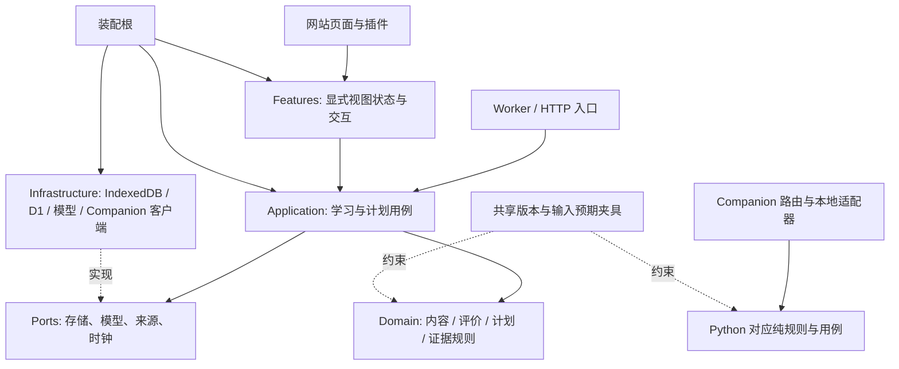

# 知学目标架构：分层的模块化单体

状态：目标设计已定；首批领域规则迁移已落地，整仓迁移尚未完成。事实基线 `f9260eb778b4ae06ead6a20725dd8b6f664d53fb`，包含原开发基线 `1b45243` 和阶段 A 候选。可复现统计见 [基线数据](baseline-20260917.json)。

## 审查结论

当前系统的主要问题是**职责集中、数据形态适配分散、重复配置和高度耦合的状态生命周期**。不宜简单称为“所有代码都坏了”：已有严格内容/事件校验、隔离存储、不可变事件与回执、沙箱及行为回归值得保留。本次静态图覆盖 313 个 TS/JS 生产文件、1,230 条本地导入边，没有发现运行时导入环；它不能证明不存在状态或运行时耦合。

| 证据 | 影响 | 处理 |
| --- | --- | --- |
| Dashboard controller：2,531 行，85 个导入声明，180 次状态/引用/副作用 Hook 调用 | 页面导航、账号、本机、同步、计划、重试相互影响；一个需求修改大面积上下文 | 冻结增长，按用例与作用域逐步拆出，保留装配根 |
| sources-view：1,307 行；subject-view：607 行、约 53 KB | 视图承载来源连接、持久化与练习生命周期 | 视图收窄为显式 props；提交与导航成为独立用例 |
| account-study-controls：199 行但约 49 KB，最长行 4,310 字符 | 行数掩盖复杂性，审查与冲突处理困难 | 同时检查字节量，触及的代码恢复可阅读格式 |
| Companion server：2,665 行；已有 routes_* 仍依赖大装配对象 | 路由拆文件并未完成依赖边界拆分 | 后续以路由服务接口注入，核心不访问 Handler/全局配置 |
| 打包和安装各维护一份程序清单 | recall_quality.py 打进包却没装入目标，已由真实安装测试复现 | 合为一个有校验的程序清单 |
| 页面词卡、原始词条、账号模型请求分别适配 | 合法词卡误拦、账号评分丢释义；独立审查已复现 | 纯领域统一内容形态与参考选择 |
| 回忆自动评价与四档调度类型共用 | 模型 easy 穿透至原本仅 good/hard/again 的流程 | 分开模型评价校验与手动调度评级，保留旧事件含义 |

## 架构选择

采用模块化单体：保持一个网站部署单元及一个本地 Companion，按领域划分代码、单向依赖和数据所有权。无需在当前规模增加微服务、消息总线或新的数据库。全量重写会丢失已验证的兼容、幂等和学习边界；只搬文件而不限制依赖又不能阻止退化。



箭头表示依赖方向；应用用例通过接口调用适配器，不 import 适配器实现。跨模块只使用公开 `index`；领域之间也不能形成循环。浏览器 Worker 的数学内核依赖纯领域实现。

## 模块与责任

| 领域 | 拥有的概念与行为 | 不拥有 |
| --- | --- | --- |
| identity / library | 已验证 owner、library、设备与权限范围 | 学生答案是否正确 |
| content | 不可变内容版本、题型数据、来源引用、技术可用性基础 | 原文写回、正式成绩、知识真实性认证 |
| assessment | 参考选择、评价证据一致性、完整/部分/错误/无法判定 | FSRS 参数、学习成绩直接写入 |
| learning | 一次作答、取消、反馈、保存、续练、临时补救状态机 | 各存储技术和供应商 HTTP |
| planning | 长期目标、每日草稿、确认、今日范围与任务分组 | 用点击或页面状态宣告掌握 |
| evidence / scheduling | 原始事件、父链、去重、可重放投影、现有调度政策 | 反向改写历史事件 |
| sync | outbox、接收回执、游标、冲突与隔离 | 为成功同步推断学习成绩 |
| sources / paper | 授权资料读取、论文结构化笔记、待批准内容候选 | 自动授予掌握或自动扩增每日负担 |
| AI services | 预算、请求身份、供应商适配、取消与结果绑定 | 对模型自评的“可信”认证 |

源笔记仍以用户本地权威资料为准。内容快照是带身份的练习材料。正式成绩来自经过验证的不可变事件；今日 UI 统计是投影。每日草稿只有显式批准后执行。浏览器草稿、临时补救、争议标记与正式记录分离。

## 目录与落地状态

```text
src/
  domain/
    content/       已落地：题型支持协议、回忆内容、词汇参考形态
    assessment/    已落地：技术内容检查、评价一致性、模型三档约束
    math/          已落地：现有有界表达式内核
    remediation/   阶段 B：原文核对、错选/漏选与执行结果分类
    practice-candidates/ 阶段 B：子卡与论文候选、审核和来源约束
    guided-math/   阶段 C：规则模板、定义域/步骤核对、原题呈现校验
    planning/      M3：计划契约、任务编辑、长期分配、题组与回合规则
    evidence/      M3：原格式的事件校验、序列化与进度契约
  application/
    study-attempt/ M2：固定请求、持久回执、幂等重试、续练及评价取消
    planning/      M3：长线/每日会话、自动草稿、批准、题组导航、旧协议用例
    temporary-practice/ 阶段 B：独立草稿、取消/迟到保护、原反馈回执观察
    guided-math/   阶段 C：临时变式会话及本页辅助历史
  infrastructure/
    artifacts/     阶段 B：用户明确触发的浏览器文件下载
    planning/      M3：FSRS 预测库适配（参数及算法保持不变）
  features/
    study-attempt/ M2：保存失败与已保存后的显示异常提示
    planning/      M3：React 生命周期、来源绑定、刷新和导航撤销
    remediation/   阶段 B：可选补练、临时代码与候选审核视图
    guided-math/   阶段 C：模板选择、最终结果与可选关键步骤
app/              路由与遗留代码；已迁移模块保留薄兼容导出
db/               现有 D1 适配器，后续逐片迁入 infrastructure
companion/        Python 服务；program-files.json 是打包与安装唯一清单
tests/fixtures/   跨语言输入与预期；语义评测与工程夹具分开
```

阶段 B/C、M2 和 M3 新模块已按上述层次实现，具体验证/集成状态见迁移表与各阶段 PR。两类正式宿主共用提交用例；计划核心和生命周期已抽出，连接/同步及后端适配仍为 M4/M5。第一批迁移没有复制两份规则：旧路径只转导出新实现，所有调用最终执行同一份函数。旧类型路径保持兼容，纯领域不再依赖插件注册器。开头的静态规模是历史基线，当前规模以架构检查输出为准。

## 关键运行流程

**展示与评分**：解码原始内容 → 按原始类型规范化 → 派生技术 ContentCheck → 插件交互 → 显式评价请求 → 身份/版本与要点一致性校验 → 展示反馈 → 用户确认提交 → 既有正式写入链 → 持久回执 → 继续。显示方式切换不得把题干回声变成答案。技术可评分不代表内容已人工核验。

**模型评价**：HTTP 边界核验用户和资料库 → 取当前/批准的内容版本 → 保留权威词义、语境、要点 → 调供应商端口 → 拒绝矛盾、未知要点与非法评级 → 返回当前作答的可解释结果。模型异常不是学生错误；看反馈本身不写成绩。

**提交与同步**：一次逻辑提交建立稳定身份 → 先保存原始事件 → 同一个 owner/content/navigation 范围内更新界面 → 各副本独立回执与重试 → 投影可重建。UI 已结束一轮不等于任务正式完成，辅助补做不覆盖首次作答。

**学习者过程**：练习页面持有临时输入；切题/退出检查未提交输入。取消请求只结束本页等待，迟到结果仍须核验绑定。刷新恢复必须有专门持久化协议，不能从临时 store 名称推断支持。

## 自动约束与限制

`npm run architecture:check` 通过 TypeScript AST 读取普通、类型、动态和重导出依赖。检查新模块层级、公开入口、领域环境依赖、不可静态解析导入、新循环、扁平 app 新业务文件和遗留热点增长。新模块默认 450 行/32 KB，热点采用基线的精确行数/字节/导入上限；这些是审查阈值，不是正确性证据。

当前未发现运行时导入环，因此不预先豁免任何环。检查器的故障注入测试验证反向类型依赖、动态导入、循环和压行增长会失败。预算修改必须独立审查；禁止自动重建配置来通过门禁。

保留既有内容身份所用的确定性 `crypto.subtle.digest`；它没有网络/存储副作用。随机 UUID、随机字节和环境时钟仍被禁止。迁移不为目录纯粹性重写哈希算法或改变旧内容身份。

限制：静态图不能发现所有别名、运行时反射和业务耦合。M5 为新的 Companion application/infrastructure 增加 Python AST 依赖、I/O、循环和安装清单检查，遗留 Python 仍只受热点与行为约束，尚无全量架构图。登录授权、跨账号隔离、历史重放和沙箱仍由对应行为测试验证。

## 迁移与后续更新

执行顺序与退出条件见 [迁移路线](migration.md)，决策记录见 [ADR-001](adr-001-modular-monolith.md)、[临时补练 ADR-002](adr-002-temporary-remediation.md) 和 [候选源格式 ADR-003](adr-003-candidate-source-format.md)。每次更新必须遵守根目录 [CONTRIBUTING](../../CONTRIBUTING.md) 与 [AGENTS](../../AGENTS.md)，不能把新目录视为可以绕开旧数据约束的自由区。

第三阶段规则模板、临时实例与旧重练兼容见 [ADR-004](adr-004-guided-math.md)；工程、语义及延迟学习证据的划分见 [学习质量验证](../learning-evaluation.md)。

共享正式作答的边界与兼容见 [ADR-005](adr-005-study-attempt-session.md)。失败重试复用第一次接受的事件身份、时间、FSRS 输入和辅助观察；页面的轮次遍历在继续时读取当前状态。草稿同时绑定原内容和题组，不能把旧题组的反馈用于新队列。核心测试直接调用公开应用 API，旧宿主回归继续检查装配是否正确。

账号、同步、AI 和 Companion 的新后端入口见 [M5 接口与修改规则](m5-backend.md) 及 [ADR-008](adr-008-backend-boundaries.md)。流式完成以持久保存为准，取消覆盖模型准备期；不要把 HTTP 编码与预算政策重新合到路由中。

公开 Companion 安装文件的独立分发、旧地址兼容及可复现构建裁剪见 [ADR-009](adr-009-companion-download-distribution.md)。这两个静态下载资源不处理用户状态，应用仍维持单体边界。

非词汇作答、待核对和分组续学的独立版本及旧协议兼容见 [ADR-017](adr-017-nonword-attempts.md)。答案与补练由侧车保存，正式事件与调度仍使用现有权威层；来源不足时保留原答案并明确能力限制。

编程可信执行、计算独立步骤、批准变式与恢复入口见 [阶段 3 契约](nonword-stage3-contracts.md) 和 [ADR-022](adr-022-code-execution-and-calculation-support.md)。首运行观察与权威作答评价分别读取；可选步骤回执失败不能丢弃仍可靠的最终结果。新增存储不迁移旧成绩。

课程回忆与选择题的任务、来源和补练内容契约见 [ADR-018](adr-018-course-task-support-v2.md)。V2保持单一参考和封闭来源引用，内容就绪检查同时约束展示与正式接收；新评价/诊断服务按独立版本接入，旧接口不冒充新任务判题。

课程诊断、侧车存储与账号正式证据联锁见 [ADR-019](adr-019-course-evaluation-evidence-v1.md)；Companion原生来源捕获及历史读取见 [ADR-020](adr-020-native-course-source-capture.md)。原生签名与portable哈希不可互替；本机判题、网页接入和用户验收尚未完成，工程或capture回执不代表完整学习入口可用。
